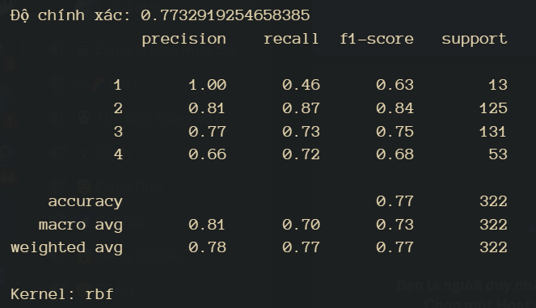
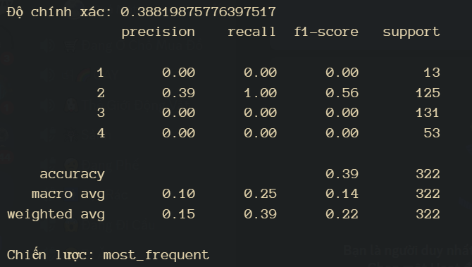

# Kết quả với SVC:

# Kết quả với Dummy Classifier:

# Kết quả so sánh

- Độ chính xác của **SVC** cao hơn so với ***Dummy Classifier***.
- Chi phí bỏ ra của **SVC** tiêu tốn hơn so với ***Dummy Classifier***.
- Cả 2 mô hình đều có 2 lớp phổ biến nhất là 2 và 3.
- Cả 2 mô hình đều có lớp 2 là lớp có chỉ số hiệu suất tốt nhất dựa trên **f1-score**.
- Ở cả 2 mô hình đều có độ dương tính cao ở lớp 2. Tuy nhiên kết quả ở lớp 2 của *Dummy Classifier* cho thấy rằng mô hình này có vẻ như có độ dương tính là 100% thế nên cho thấy việc mô hình này **không** phù hợp với lại tập dữ liệu vì ***recall*** mà 100% sẽ gây ra việc phân loại sai xảy ra rất nhiều vì hầu hết cả trường hợp âm dương tính đều bị cho là dương tính.
- Tuy nhiên có thể thấy rõ rằng ở cả 2 mô hình dường như Dummy Classifier không có độ chính xác tốt trong việc phân loại tập dữ liệu này.
